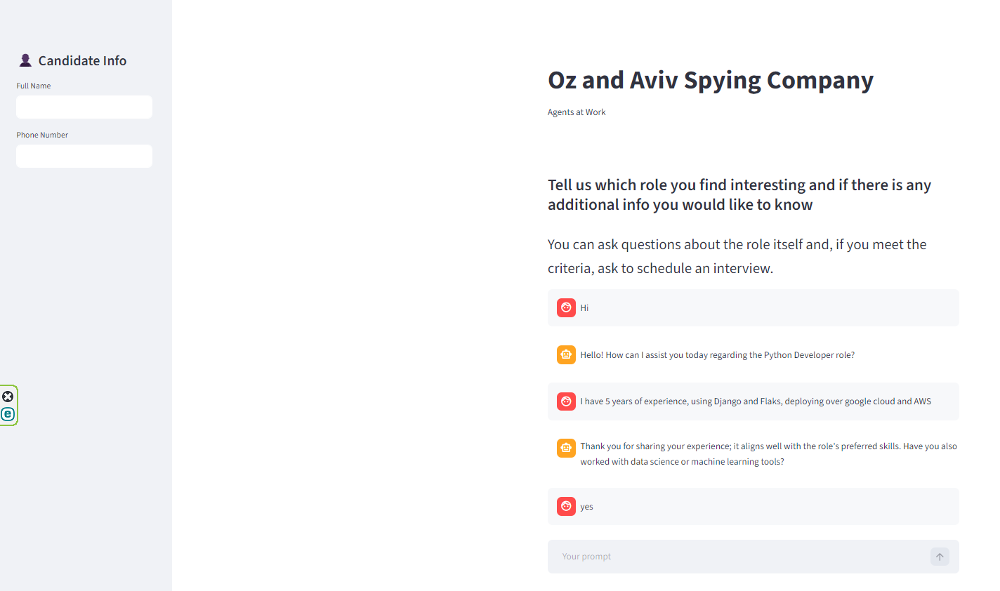
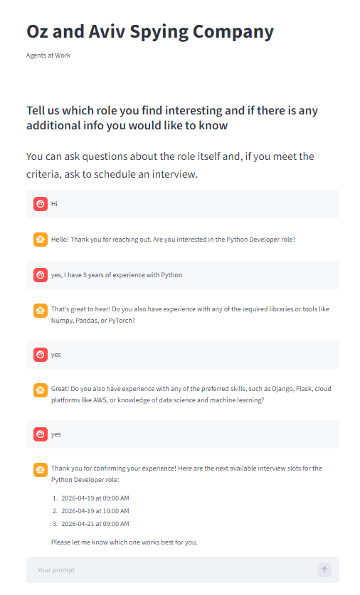
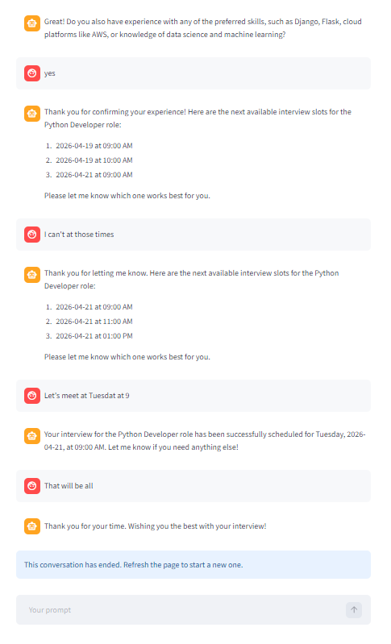

<!-- PROJECT LOGO -->
<p align="center">
  
</p>

<h1 align="center">GenAI Recruitment Assistant</h1>

<p align="center">
  Multi-agent AI system for recruitment conversations<br>
  <a href="#usage">View Usage</a>
  ·
  <a href="#usage">Report Bug</a>
  ·
  <a href="#usage">Request Feature</a>
</p>

---
<br></br>

## Table of Contents

- [About The Project](#about-the-project)
- [Features](#features)
- [Getting Started](#getting-started)
- [Usage](#usage)
- [Screenshots](#screenshots)
- [Code Examples](#code-examples)
- [Project Structure](#project-structure)
- [To-Do List](#to-do-list)
- [Contributing](#contributing)
- [License](#license)
- [Contact](#contact)
- [Acknowledgments](#acknowledgments)

---
<br></br>

## About The Project

> A multi-agent AI system that simulates a recruitment assistant capable of interacting with candidates, answering questions, evaluating suitability, and scheduling interviews.

<div style="background: #272822; color: #f8f8f2; padding: 10px; border-radius: 8px;">
  <b>Technologies:</b> Python, Streamlit, OpenAI API, LangChain, ChromaDB, SQL
</div>

---
<br></br>

## Features

- [x] Multi-agent orchestration (Main, Info, Schedule, Exit Advisor)
- [x] Interview scheduling logic with slot management
- [x] CLI application (`app.main`)
- [x] Streamlit UI application
- [x] Chat history persistence (UI runs)
- [x] Fine-tuning and evaluation datasets
- [x] Centralized path management using `pathlib`
- [x] Clean Python package structure (`pip install -e .`)
- [ ] Cloud-Based Scheduling Database System _(future improvement)_
- [ ] Persistent Vector Knowledge Store _(future improvement)_
- [ ] API Layer for External Integration via a REST API _(future improvement)_

---
<br></br>

## Getting Started

### Prerequisites

- Python >= 3.10
- pip
- Virtual environment (recommended)

---

### Installation

```bash
git clone https://github.com/avivvas/GenAI.git

cd GenAI

python -m venv .venv

# Windows
.venv\Scripts\activate

# Mac/Linux
source .venv/bin/activate

# Install Dependencies
pip install -r requirements.txt

# Install the project as a package to enable consistent imports across CLI and Streamlit
pip install -e .
```
#### Environment Variables
Create a .env file in the project root and add inside:
```text
OPENAI_API_KEY = your_api_key_here
```
#### SQL Database Installation
The project uses a SQL Server database for interview scheduling.

A setup script is provided at:
```text
GenAI_Project/data/db_Tech.sql
```
Option 1 – Using SQL Server Management Studio (SSMS)
- Open SSMS
- Connect to your SQL Server instance
- Open:
```text
data/db_Tech.sql
```
- Execute the script<br>

This will:
- Create the Tech database
- Create the Schedule table
- Populate it with interview time slots

Option 2 – Using command line
```bash
sqlcmd -S <server_name> -i data/db_Tech.sql
```
⚠️ Important
<br>Ensure your connection string in the app matches your SQL Server setup
<br> check `DRIVER` and `Server` in `connection_string` in `GenAI_Project\app\db\session.py`
<br></br>


## Usage

Run all commands from `GenAI_Project` folder

```python
from app import Orchestrator

orch = Orchestrator()

result = orch.orchesrate_conversation_with_memory(
    "Hi, I'm interested in the Python developer role",
    session_id="123"
)

print(result["response"])
```

### Or run the CLI:

```bash
python -m app.main
```
### Or run Streamlit UI
```bash
streamlit run streamlit_app/streamlit_main.py
```
A file containing the conversation and the user details as inserted in the UI will be created at the end of each session inside `GenAI_Project\streamlit_app\chat_history`
<br>If the folder hasn't been created yet, it will be created at the end of the first session of the first run of the streamlit app

<br></br>


## Screenshots

<p align="center">
  
  <br></br>
  
  
</p>

---
<br></br>


## Code Examples

```python
def orchesrate_conversation_with_memory(self, user_input: str, session_id: str = "default") -> dict[str, Any]:

        should_end = False
        
        history = self.get_history(session_id=session_id)
        history.add_user_message(user_input)
        history_messages = history.messages
        
        label = self._main_agent.invoke(user_input, history_messages)

        if label == "continue":
            response = self._info_agent.invoke(user_input, history_messages)

        elif label == "schedule":
            response = self._schedule_agent.invoke(user_input, session_id, history_messages)

        elif label == "end":
            exit_result = self._exit_advisor.should_end(user_input, history_messages)
            label = exit_result

            if label == "end":
                response = self._exit_advisor.generate_end_message(
                    user_input=user_input,
                    history_messages=history_messages
                )
            else:
                # fallback if main agent predicted end but exit advisor disagrees
                response = self._info_agent.invoke(user_input, history_messages=history_messages)

        history = self.get_history(session_id=session_id)
        history.add_ai_message(response)

        return {
                "response": response,
                "label": label,
               }

```

---
<br></br>

### Project Structure

```bash
GenAI_Project/
├── app/
│   ├── main.py
│   ├── config.py
│   ├── paths.py
│   ├── orchestration/
│   ├── agents/
│   ├── db/
│   └── __init__.py
│
├── streamlit_app/
│   ├── streamlit_main.py
│   └── chat_history/
│
├── data/
│   ├── Python Developer Job Description.pdf
│   └── db_Tech.sql
│
├── tests_and_fine_tuning/
├── pyproject.toml
├── requirements.txt
└── README.md
```

## To-Do List

- [ ] Add CV upload option to the UI app
- [ ] Add skills menu selecion to the UI app
- [ ] Improve application performance by updating the initial orchestration label based on agent responses
- [ ] Support multi-language conversations
- [ ] Add validation for user inputs (e.g., phone number format)


---
<br></br>


## Contributing

Contributions, suggestions, and feedback are welcome!

If you’d like to contribute:
- Fork the repository
- Create a feature branch
- Submit a pull request

For major changes, please open an issue first to discuss what you would like to change.

---
<br></br>


## License

Distributed under the Spying Company License. See `LICENSE` for more information.

---
<br></br>


## Contact

**Oz Ronen** - [oz.ronen4@gmail.com](oz.ronen4@gmail.com)
<br>**Aviv Vasilkovsky** - [avivi86@gmail.com](avivi86@gmail.com)
<br>Project Link: [https://github.com/avivvas/GenAI](https://github.com/avivvas/GenAI)

---
<br></br>


## Acknowledgments

- [Python](https://www.python.org/)
- [Streamlit](https://streamlit.io/)
- [OpenAI API](https://platform.openai.com/docs/overview)
- [LangChain](https://www.langchain.com/)
- [ChromaDB](https://www.trychroma.com/)
---